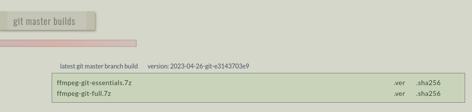
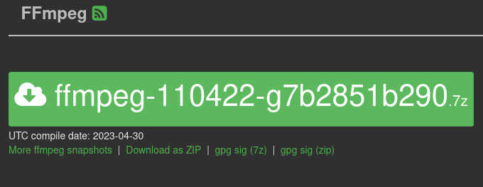

####################
Installing FFmpeg
####################

For the most up-to-date instructions on how to install FFmpeg on your operating system, you should check the `FFmpeg Official Website <https://ffmpeg.org/download.html>`_.

************
Windows
************

Downloading
=============================
- The current builds for Windows are provided by gyan.dev.

- Follow the link from `FFmpeg's Downloads page <https://ffmpeg.org/download.html#build-windows>`_.

- It is generally recommended to use the latest "git master build" of FFmpeg.

- The "full" build will have more libraries enabled than "essentials", so download the "full" build.

- Once the download is complete, extract the files (you will need to have 7-Zip installed to extract the  .7z files. Alternatively, .zip files are also available `on github <https://github.com/GyanD/codexffmpeg/releases>`_).

- Inside the extracted folder, you will see a folder named "bin" that contains the executables for FFmpeg.

- If you just double click these files, a command prompt window will briefly open, then close.

- For now, if you want to run FFmpeg, you'll either need to drag and drop the "ffmpeg" file in the "bin" folder onto the command line or use the command line to navigate to the "bin" folder and run FFmpeg commands from there.

Adding FFmpeg to Path
=============================

In order for FFmpeg to be easily callable by simply typing ``ffmpeg`` into the command line, we'll need to add it to the "Path" for your username.

- Start by placing the contents of the FFmpeg bin folder in an easy to remember location, such as a dedicated "Applications" folder in your "C" drive.

- Next search for "environment variables" in the search bar and select the option "Edit the system environment variables".

- This will open the System Properties window.

- In this window, click the "Environment Variables" button near the bottom.

- This will open the "Environment Variables" window.

- In the top section of this window, you'll notice an entry in the "Variable" column called "Path".

- Double click the "Path" entry, or select it and then click the "Edit" button below.

.. image:: images/windows_install3.png

- This will open the "Edit environment variable" window.

- In this new window, click the "New" button.

- Now enter the path to the folder that contains your FFmpeg folder (for example, if you put your files in an "Applications" folder in your "C" drive, you would enter "C:\\Applications").

- To verify that the installation works, continue on to :doc:`section 5 <verifying_installation>`.

************
Mac
************
There are several options for installing FFmpeg on Mac computers

Option 1 - Install a Static Build
==========================================

Downloading
--------------------------------

- Follow the Static Build Download link from the `FFmpeg website <https://ffmpeg.org/download.html#build-mac>`_.

- This will take you to a new page where you can download FFmpeg, FFprobe, and FFplay separately.

- FFmpeg recommends downloading the latest snapshots over the releases, so click the green button on the left with the a long name that looks something like: ffmpeg-(some long string of numbers and letters).7z.

- Scroll down and repeat this for the FFplay and FFprobe download links on the page as well.

- Once all the files have finished downloading, navigate to your Downloads folder and extract each of the ".7z" files by double clicking them.

.. image:: images/mac_install1.png

- You should now have an "ffmpeg", "ffprobe", and "ffplay" file in your downloads folder. You can drag and drop these files into a Terminal window as is to run them, but if we want them to be easily accessible on the command line they'll need to be added to your $PATH.

Adding FFmpeg to Path
-------------------------------

- Start by opening your "Applications" folder, navigating to the "Utilities" folder, and opening the Terminal application.

- In the Terminal, run the following command (copy and paste the command, then press Enter/Return) to change directories to your Downloads folder where the "ffmpeg", "ffprobe", and "ffplay" files are located.

.. code-block:: bash

   cd ~/Downloads/

- At this point, you can verify that you're in the right location by running the ``ls`` command as described in Section 3.1.4. When trying to run the command you may get a prompt asking if you want to allow Terminal to access your downloads folder. Select "Yes" and the command will run. You should see the FFmpeg files that you downloaded and extracted listed in the output if you are in the right location.

- Now that you are sure you are in the right directory, it's time to make the folder "/usr/local/bin" so that we'll be able to move our files there. Run the following command:

.. code-block:: bash

   sudo mkdir -p /usr/local/bin/

- You will be prompted for your password and should not see any additional messages if the command ran successfully.

- Now that the folder has been created, we simply need to copy our files there. Run the following command:

.. code-block:: bash

   sudo cp ffmpeg ffprobe ffplay /usr/local/bin

- If you want to make sure that you successfully copied the files, you can run this command to list the contents of "/usr/local/bin":

.. code-block:: bash

   ls /usr/local/bin

- You should see your FFmpeg files listed in the output.

- To verify that the installation works, continue on to :doc:`section 5 <verifying_installation>`.

Uninstalling
-------------------------------

- To uninstall the FFmpeg files, you simply need to delete the files from the folder we put them in.

- Start by opening a Terminal window and changing directories to "/usr/local/bin".

.. code-block:: bash

   cd /usr/local/bin

- Check that you are in the right location by running the ``ls`` command. You should see the "ffmpeg", "ffprobe", and "ffplay" files listed in the output.

- Once you have confirmed that you are in the right location, run the ``rm`` command as a superuser to delete the "ffmpeg" file (NOTE: Be careful whenever running the ``rm`` command as a superuser. Make sure that you are only deleting the files you want to delete before running the command). The command will prompt you for your password before running.

.. code-block:: bash

   sudo rm ffmpeg

- If the command completes successfully, you can now do the same for the "ffprobe" and "ffplay" files.

.. code-block:: bash

   sudo rm ffprobe
   sudo rm ffplay

Option 2 - Use a Package Manager
==========================================
- For an experience similar to Linux you can use a third party package manager for Macs like `Homebrew <https://brew.sh/>`_ or `MacPorts <https://www.macports.org/>`_.

- Further information on this process can be found `HERE <https://trac.ffmpeg.org/wiki/CompilationGuide/macOS>`_.

************
Linux
************
- FFmpeg can be installed using your operating system's package manager in most cases.

- On some Linux distributions, you may need to enable non-free repositories before you can install FFmpeg.

- For running the most recent or specific versions of FFmpeg, static builds are also an option.

- To verify that the installation works, continue on to :doc:`section 5 <verifying_installation>`.

**************
ChromeOS
**************
- NOTE - NEED TO TEST

- ChromeOS is based on Linux and should, in theory, be able to install FFmpeg using a .deb file

- Static builds for Linux may also work on ChromeOS(?)

- To verify that the installation works, continue on to :doc:`section 5 <verifying_installation>`.
